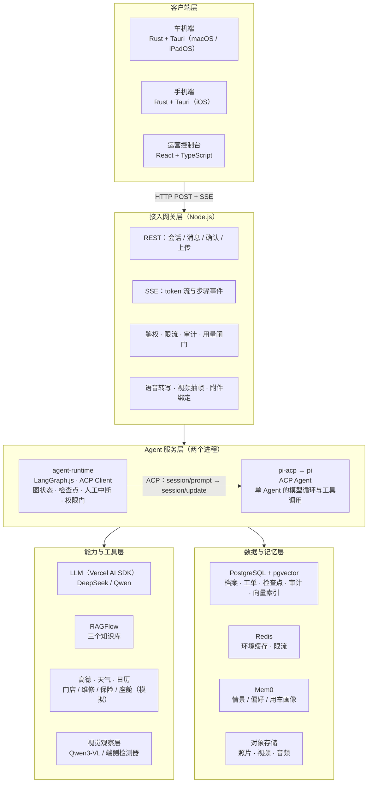
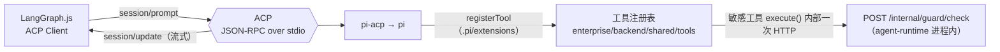
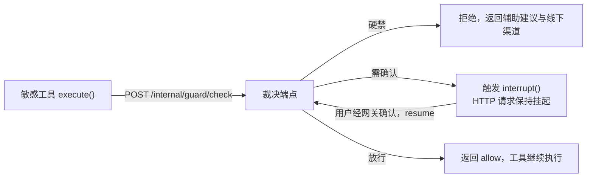
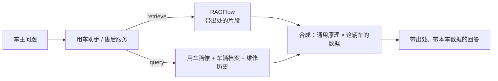
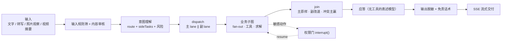

# 技术架构说明

本文说明 CarLife AI Agent 的系统架构：模型选择、Agent 架构、工具调用方式、知识库与检索增强、多轮对话与上下文管理、工作流编排、数据处理流程与安全边界。目标读者是要评估、部署或二次开发本系统的工程人员。

怎么装、怎么跑见 [逐步部署手册](step-by-step.md)；每个外部服务的配置项与未配置时的降级行为见 [配置外部服务](external-services.md)；数据来源与合规说明见 [data/README.md](../data/README.md)。本文只讲结构与取舍，不重复这些内容。

## 系统总览

系统分五层：客户端层、接入网关层、Agent 服务层、能力与工具层、数据与记忆层。终端与服务端之间只用 HTTP（REST + SSE），不用 WebSocket。

各层的职责边界：

| 层 | 职责 | 不做什么 |
|---|---|---|
| 客户端 | 语音采集、界面、本地缓存、凭证存储；Rust 侧承担网络、鉴权、媒体、加密 | 不持有任何供应商密钥；能力白名单不含车辆控制 |
| 接入网关 | 协议转换与治理：鉴权、限流、审计、多模态上传、人工确认中转、语音与视频派生 | 不含业务逻辑，不直接调用 LLM 与工具 |
| Agent 服务 | 跨 Agent 编排、单 Agent 执行、安全管线、权限裁决 | 子 Agent 之间不互相调用 |
| 能力与工具 | 每个工具是独立的 TypeScript 模块，可单测、可复用 | 工具不感知 Agent，Agent 经允许清单拿到工具 |
| 数据与记忆 | 六类记忆按类别分流存储 | 不把所有记忆放进一个向量库 |

## 模型选择

| 用途 | 模型 | 接入方式 | 未配置时 |
|---|---|---|---|
| 对话与表述（文字） | DeepSeek `deepseek-flash` | Vercel AI SDK `@ai-sdk/deepseek` | 确定性 Fake 模型，链路照常可跑 |
| 对话与表述（带图片的轮次） | `DEEPSEEK_VISION_MODEL`，缺省与文字档相同 | 同上，按单次请求是否带图片切换 | 同上 |
| 单 Agent 循环（pi 内） | 与上一行相同的 DeepSeek 模型 | pi 的模型配置 | 同上 |
| 照片观察层 | Qwen `qwen3-vl-flash`（定位）/ `qwen3-vl-plus`（描述），可换 DeepSeek 视觉档；定位一遍可换端侧 YOLO 检测器 | DashScope 兼容接口 | 观察层关闭，照片只作为图片交给表述模型 |
| 图文向量 | Qwen `qwen3-vl-embedding`（图文同空间，2560 维） | DashScope 原生接口 | 图标匹配与手册图示检索不可用 |
| 语音识别 | 火山方舟 `doubao-seed-2-0-mini`（默认）/ DashScope `qwen3-asr-flash` / 本机 llama.cpp + Qwen3-ASR-0.6B | 网关统一封装，`ASR_ENGINE` 选档 | Fake ASR 或向终端提示不可用 |
| 语音合成 | 字节 `seed-tts-2.0` / DashScope `qwen3-tts-flash` / mock | 网关 `/v1/tts/speech`，终端不直连供应商 | 车机端降级到系统 TTS |
| 内容审核 | 阿里云 AI 安全护栏（默认）或任意 OpenAI 兼容审核端点 | `GUARD_PROVIDER` 选择 | 规则筛与脱敏仍运行，审核层按 fail 策略降级并留痕 |
| 知识库检索 | RAGFlow（托管） | HTTP API | 检索标记未接入，不伪造出处 |

三条与模型相关的工程约束：

- **思考档逐调用点显式声明。** DeepSeek 现役模型默认开启思考，SDK 没有关闭参数。运行时在请求层包装一次，每个调用点必须声明要不要思考；有一条测试扫描源码，未声明的调用点不能通过。判据：输出给人且要在多步工具间取舍的会话才思考，输出给代码解析的、纯表述已求解内容的、探针一律不思考。
- **视觉档按请求判断，不按会话钉死。** 只有本次请求带图片时才切视觉档；图片只挂在当前轮，历史轮只留一句附件备注。
- **用量记录响应里的模型名，不记请求里的。** 供应商会把旧模型名别名到新模型，按请求名记账会失真。

## Agent 架构

### 编排与执行分成两个进程

Agent 服务层是两个物理进程，只通过 ACP（Agent Client Protocol）通信：

- `enterprise/backend/agent-runtime`：LangGraph.js，扮演 ACP Client。负责跨 Agent 的图、共享状态、检查点、人工中断、路由与安全裁决。
- `enterprise/backend/pi-agents`：开源 `pi-acp` 桥接 `pi --mode rpc` 子进程，扮演 ACP Agent。负责单 Agent 内的模型循环、工具调用与流式输出。这个目录里只有提示词与工具注册配置，没有协议代码。

编排层不 import pi 的 SDK，只发 ACP 消息。换掉执行器不需要改编排层；执行器崩溃不拖垮编排进程。

### 一个主控与五个业务 Agent

| Agent | 场景 | 主要工具 | 知识库 | 需要人工确认的动作 |
|---|---|---|---|---|
| 购车顾问 | 车型比较、费用测算、试驾 | 车型库、费用计算、门店与时段查询 | `car-catalog` | 试驾下单 |
| 用车助手 | 「这个功能怎么用」「我这车正常吗」 | 车辆档案、用车画像、数据新鲜度、日历写 | `vehicle-manuals` | 档案补录写入 |
| 出行规划 | 多日行程、沿途补能、导航交付 | 地图、天气、充电、日历读写、能源缺口 | 可选 | 方案确认（含写日历） |
| 座舱陪伴 | 舒适域设置、内容推荐、闲聊 | 座舱状态与控制 | 无 | 儿童模式相关动作 |
| 售后服务 | 拍照与视频问诊、风险分级、维修预约 | 预约、工单、维修历史 | `repair-kb` | 维修下单 |

试驾预约是购车阶段内独立的多步引导流程，有自己的跨轮状态与一个有副作用的终点，因此作为独立的子图存在。

### 子 Agent 从不互相调用

需要跨 Agent 结果时，编排层在并行 fan-out 里对多个 Agent 各发一次独立的 `session/prompt`，再把结果汇总回图状态。行程规划里的四个分支（路线、住宿、景点、公共交通）就是这样并行求解的，硬约束（住宿锚定、连续驾驶时长、返程闭环）由代码在汇聚时做，模型只负责表述。

### 子 Agent 的两种形态

| | Agent 自主 | 编排层求解 |
|---|---|---|
| 谁决定调什么工具、填什么参数 | pi 里的模型 | 子图代码（状态机） |
| 编排层做什么 | 发一次 prompt，收结构化结果 | 全套求解，模型只表述 |
| 权限门 | 按工具的 `sensitive` 标记自动接管 | 子图自己调用裁决 |
| 适用 | 默认 | 多步引导且终点有副作用的流程（试驾下单） |

判据：如果在写「识别用户说的是哪个参数」的代码，就是选错了形态，那是模型的工作。正则只作为离线或 Fake 模式下的确定性兜底。

### 复合意图：主任务加至多三条副任务

一句话里带着第二个领域的事（「去杭州自驾，顺路把保养做了」）时，意图理解除主路由外输出副任务列表，每条副任务自带地点与对象。图上每个分支节点注册成主副两套同形态节点，同一个超步里并行派出；汇合时主任务的写入原样生效，副任务只写自己的通道，冲突时主任务优先；最后由应答节点把主副结果说成一段话。需要确认的动作按会话排队，同一时间只弹一条确认，主任务先于副任务。

### 求解与表述分开

应答节点走直连的表述模型，它的系统提示词写明自己没有任何工具。工具调用与硬约束求解都在它之前完成，表述阶段不再调工具。这样做的目的是让「查到了什么」与「怎么说」可以分别验证。

## 工具调用方式

### 注册与下发

- 工具实现在 `enterprise/backend/shared/tools`，每个工具声明名称、参数 schema、允许使用它的 Agent 列表、是否敏感。
- 工具经 `.pi/extensions/` 的 `pi.registerTool` 注入 pi。pi 按 ACP `session/new` 的 `cwd` 发现项目级配置。
- pi 内置的 read / bash / edit / write 工具全部关闭；每个 Agent 只拿到允许清单里的工具；业务提示词经 `--append-system-prompt` 进入真正的系统提示词。
- 只被编排层直接调用的工具（如行程可执行性体检）注册为空允许清单，模型手里没有它。

### 动作权限门

敏感工具（预约、下单、写日历、影响第三人的座舱动作）在自己的 `execute()` 里发一次内部 HTTP 请求到编排进程的裁决端点。这条路径与 ACP 协议无关。

| 动作类别 | 裁决 |
|---|---|
| 自动驾驶决策、车辆安全控制（动力、转向、制动、驻车、门窗、儿童锁解除）、替代专业维修的确定性结论 | 硬禁，自动拒绝，不进人工确认 |
| 试驾预约、维修下单、写日历、儿童模式动作 | 挂起，等用户在终端确认后继续 |
| 只读工具（天气、路线、车型库） | 直接放行 |

舒适域设置（空调、座椅、氛围灯、媒体、香氛）不属于安全控制，正常放行；模拟车机只建模舒适域，安全域在设备层不存在。

### 问事实与问授权是两种机制

权限门问的是授权：「要不要替你把这单下了」，用户不回答则动作不执行。事实补录问的是事实：「上次保养是什么时候」，用户不回答则继续服务但对应结论降级并说明。两者外形相似，语义相反，分成两条通路。事实补录一轮最多问一个、拒答留痕并冷却、口述值与实测数据分开存放，且拒答不影响任何下游 Agent 的上下文与工具集。

## 知识库与检索增强

### 三个数据集按消费方划分

| 数据集 | 消费方 | 内容 |
|---|---|---|
| `vehicle-manuals` | 用车助手 | 车主手册、导航娱乐系统手册 |
| `repair-kb` | 售后服务 | 保修保养手册、故障码表、维修工艺、官方警报说明 |
| `car-catalog` | 购车顾问 | 车型手册、配置参数、价格表 |

隔离在调用层由代码强制，不依赖提示词。

### 双路检索

用车与售后的问题永远是两路并发：一路查知识库（通用原理，带出处），一路查这辆车的真实使用数据（近期里程、充电习惯、历史续航表现、维修历史）。两路一起交给模型，答案才带有「你这辆车」的判断；只查知识库会得到任何人问都一样的通用答案。

合成层从检索片段里单独抽出警告句（切勿、请勿、务必一类），按与原话的相关度排序、最多四条、带出处；一条都不相关时不给这一段。回答里的警告只能来自片段，不能来自常识。

### 语料处理

- PDF 先经 MinerU 转 markdown 再上传，不直接传 PDF：托管解析器处理不了多栏排版，三栏手册会被按行横读。
- 切片前做语义边界处理：每个切片单元开头带「文档 › 章 › 节」面包屑，并短节、切长段留 15% 重叠、表格整块不切。目标是中位块长落在 256 到 512 token，短于 50 token 的块接近 0。
- 转换时保留手册图片与版面块表，图与讲它的段落的对应关系由纯函数按坐标计算（同行、上文引用、相邻、上一页四条规则，各带置信度），不调视觉模型；置信度低的图不进索引。

### 图标与图示索引

用户拍到的是符号，文本检索找不到符号。每个车型有一份人写的图标目录（受控描述子、名称、类别、级别、手册锚点），图标图片与描述子经图文向量进 PostgreSQL 的 pgvector 表。匹配流程是双路召回、分数与边际闸门、成对核验（用户裁下的图与手册图标并排，只答相同、不同或不确定）。向量只负责召回不负责裁决；没有通过核验的匹配只能说「疑似」。

手册其余的图（按钮位置、充电口示意、屏幕截图）进另一张 pgvector 表，作为问诊的第三路检索，命中带锚定段与页码，最相关的一张图交给表述模型。

## 多轮对话与上下文管理

### 六类记忆分治存储

| 类别 | 存放 | 衰减 |
|---|---|---|
| 短期任务状态 | LangGraph 图状态（PostgreSQL 检查点）+ pi 会话 | 会话结束或 24 小时硬过期 |
| 情景记忆 | Mem0 | 指数衰减，半衰期约 30 天，约 180 天硬删 |
| 偏好记忆 | Mem0 | 慢衰减加访问强化，半衰期约 365 天，不硬删 |
| 车辆档案 | PostgreSQL | 不衰减，事件驱动更新 |
| 环境缓存 | Redis | 分钟到小时级 TTL；目的地推荐与导览简报按周 |
| 用车数据 | 原始流水进 PostgreSQL 时序表，定时聚合成用车画像写 Mem0 | 原始流水不衰减；画像半衰期约 180 天 |

Mem0 没有内置的 TTL 与衰减，按类衰减是自建的薄封装：写入时带类别与时间戳，检索期按半衰期加权重排，定时任务做硬删与聚合。Mem0 的向量库是同一台 PostgreSQL 上的 pgvector，备份归入现有的 `pg_dump`。

「不衰减」不等于「永远可信」。车辆档案与用车流水都能回答「这条事实是什么时候的」，陈旧时下游降级并触发一次事实补录询问；补录来的口述值标记来源，不与实测数据混同，也不会生成行程流水。

### 会话与轮次

- 一个会话对应一个 LangGraph thread，每轮的图状态落 PostgreSQL 检查点，进程重启后挂起中的人工确认可以续跑。
- 意图理解、每个业务 Agent、应答各有独立的 pi 会话；输出给代码解析的会话不思考。
- 一轮可以有一个旁路会话：它只读订阅主会话的事件流，在静默超过阈值时向终端播一句垫场话。它不进路由表、不写图状态、只有播报一个工具、失败静默，垫场内容走同一条输出管线。
- 图片只挂在当前轮，跨轮检查点里不存图片字节。
- 终端经 SSE 收 token 流与步骤事件，断线后按 `Last-Event-ID` 续传；垫场话不进续传窗口，也不进对话历史。

### 用户身份与可见域

一车一主由车辆表的 `ownerId` 表达；非车主的使用者经授权表拿到 driver 或 passenger 角色，撤销后下一请求即失效。数据分三个可见域：私有域（记忆、对话、个人行程、日历，按用户），车辆共享域（档案、保养维修、整车用车聚合，按车辆），平台公共域（车型库、知识库、环境缓存）。车机上的「上车声明」决定业务层以谁的身份读写个人域；访客与乘客的能力裁剪发生在工具清单组装与入参，不在提示词里。

## 工作流编排

### 一轮的主图

### 行程规划的体检与修复循环

行程草案进确认弹窗之前先过一遍确定性体检：逐日住宿、返程闭环、单段与全天驾驶时长、停靠占位、约束覆盖，每项带依据，输入缺失标「验不了」而不用默认值冒充。有阻塞项才进修复循环：单段超限由代码重拆，缺住宿、缺停靠、全天超限各追发一次对应 Agent；最多三轮，预算耗尽即止。未消解的项以四类行（已验、请你看、验不了、已自动补）进确认弹窗，不阻塞交付。体检结果不写进已确认的行程。

### 后台任务与定时任务

- 行程确认后，景点导览采集逐景点进 pg-boss 队列后台执行（PostgreSQL 上的独立 schema），并发为 1，任务内部三分支并行。
- 定时任务（`enterprise/backend/worker`）：记忆衰减与硬删、用车数据聚合、知识库同步、车辆提醒、空会话清理、行程每日核查。定时任务里没有 LLM 调用：行程每日核查只比对天气与路线摘要的签名，变化点由终端展示，改不改仍经用户确认。
- 途中提醒（快到停靠点、连续驾驶过久）的判据与闸门全在终端，是时钟入参的纯函数，出声走终端直连 TTS，不进会话。

## 数据处理流程

### 输入

| 输入 | 处理位置 | 处理内容 |
|---|---|---|
| 语音 | 终端采集裸 PCM，网关补 WAV 头后转写 | 唤醒词判定在终端按拼音归一匹配，未命中的转写判定后即弃，不进会话与记忆 |
| 文字 | 网关校验后转发运行时 | 单条上限 500 字符 |
| 照片 | 网关校验归属后取件，运行时的观察层在路由之前处理 | 定位每盏灯、代码按像素定色、逐图描述；结构上没有名称与级别字段，名称与级别只来自手册图标目录的匹配 |
| 视频 | 网关在建轮时派生 | 只取前 60 秒，每 10 秒一张帧序图，音轨分段转写带时间点；转发的是帧序图与转写，不是原件 |
| 车机警报页截图 | 观察层的可选能力 | 抄下代码与原话，按代码精确查本地表，查不到明写「手册里没有收录」 |

每轮附件上限 9 张照片加 1 段视频，上限常量在 `contracts/` 一份，终端预检、上传头、网关白名单共用。

### 输出

回答经输出层脱敏（手机号、身份证、银行卡、邮箱）与售后场景的风险等级与免责话术注入后，经 SSE 流式交付。终端把同一路事件同时喂给 HUD 助手形象的状态机与对话层的消息记录。

### 存储

| 存储 | 内容 |
|---|---|
| PostgreSQL（含 pgvector） | 用户、车辆、授权、设备、档案、保养维修记录、工单、审计日志、LLM 用量、LangGraph 检查点、用车流水、Mem0 向量、图标与手册图示向量、任务队列 |
| Redis | 环境缓存、限流与日用量计数 |
| 对象存储（MinIO / S3 兼容） | 照片、视频、音频 |
| RAGFlow | 知识库文档与索引 |
| 终端 SQLite | 会话与消息的本地缓存、附件引用 |
| 终端凭证库 | 访问令牌与刷新令牌，按设备角色分条目；WebView 拿不到原始令牌 |

演示数据、知识库语料的来源与授权、个人信息的处理方式见 [data/README.md](../data/README.md)。

## 安全边界

四道防线加一道物理兜底。前三道是内容管线，挂在编排进程一侧，对所有 Agent 统一生效；第四道是动作权限门。

| 层 | 位置 | 做什么 |
|---|---|---|
| 输入规则筛 | `enterprise/backend/shared/guardrails/src/input` | 长度上限与中英双语提示注入正则，零延迟，命中即拒 |
| 内容审核 | `enterprise/backend/shared/guardrails/src/moderation` | 阿里云 AI 安全护栏或 OpenAI 兼容端点；输入侧 fail-open，输出侧 fail-closed；配置存库、热更新 |
| 输出脱敏与话术 | `enterprise/backend/shared/guardrails/src/output` 与 `agent-runtime/src/guard` | 个人信息正则脱敏（长规则先跑）；售后回答注入风险等级与免责话术 |
| 动作权限门 | `agent-runtime/src/guard/http-endpoint.ts` | 硬禁清单自动拒绝；有后果的动作挂起等用户确认；每次裁决落审计表 |
| 终端能力白名单 | `clients/*/src-tauri/capabilities/` | 不暴露任何车辆控制能力，有静态扫描守着 |

配套的工程约束：

- 终端不持有任何供应商密钥。语音合成、语音识别、地图安全密钥都经网关代理；地图 JS key 是 SDK 固有形态留在前端，靠域名白名单约束。
- 网关有按日的供应商用量闸门（语音识别调用次数、语音合成字符数），超限降级不拒绝，计数失败放行。
- 运维配置分两条出口：解密后的真实值只给服务端内部，接口层只拿到掩码与来源；硬禁清单与能力白名单只在代码里，任何角色都不能在后台改。
- 依赖的外部服务都有探活与显式降级：门店系统不可达时助手明说「门店系统没连上」，不编造结果。

## 客户端

车机端与手机端是同一套 Rust 内核加 WebView 前端（Tauri 2）。Rust 侧承担网络（REST + SSE 客户端、断线重连）、鉴权与凭证库、录音与 VAD、回声消除、图片处理、本地缓存与附件上传；React 只负责界面。两端共用的组件在 `clients/shared/ui`，共用的 Rust 层在 `clients/shared/rust`（会话与鉴权、网络、媒体、唤醒词判定、埋点）。

默认交互不是聊天框，是 HUD 加助手形象：状态机有空闲、聆听、思考、说话、警示五个状态，结果以语音播报加浮层卡片呈现；完整对话记录经底部导航进入。人工确认弹窗跨层浮出，不会因为用户不在对话层而漏掉。

端云契约（协议事件、领域模型、常量）只在 `contracts/` 一份，Rust 侧结构体经 ts-rs 从它生成。

## 评测

评测集与 runner 在 `evals/`，判定内核留在各包的测试里。指标口径的三条总则：只分列不聚合（不设加权总分）；没有判定的题不进分母并逐一具名；能用确定性断言的维度不用模型裁判。

| 评测 | 命令 | 判什么 |
|---|---|---|
| 核心场景 | `corepack pnpm eval:scenarios`（加 `--real` 走真实模型） | 路由、SSE 事件子序列、编排层交付给应答的内容；真实档另判工具调用与回答要素 |
| 风险拦截 | `corepack pnpm eval:risk` | 红队样本按硬禁类别分列的拦截率、无确认执行数、层间漂移 |
| 记忆衰减 | `corepack pnpm eval:memory-decay` | 半衰期排序与硬删边界 |
| 照片观察 | `corepack pnpm eval:vision-observe` | 定位、定色、图标匹配、误接受率 |
| 手册图锚定 | `corepack pnpm eval:figure-anchor` | 图与段落对应的准确率，低于 90% 退出非 0 |

## 验证与探活

| 命令 | 验证什么 |
|---|---|
| `corepack pnpm smoke:llm` | LLM 连通 |
| `corepack pnpm smoke:acp` | 编排层到 pi 的 ACP 全链路 |
| `corepack pnpm probe:ragflow` | 知识库连通、解析状态与数据集隔离 |
| `corepack pnpm probe:amap` | 地图与路径规划 |
| `corepack pnpm probe:aliyun-guard` | 内容审核连通与该账号启用的检测维度 |
| `corepack pnpm probe:latency` | 端到端分跳耗时 |
| `corepack pnpm demo:verify` | 演示前只读检查单，逐项给结论与修复命令 |
| `corepack pnpm selfcheck` | 分层自检 |
| `corepack pnpm demo:fault-inject` | 停掉模拟门店后提问，断言如实兜底、零编造、自动恢复 |

## 代码地图

| 目录 | 内容 |
|---|---|
| `clients/cockpit`、`clients/mobile` | 车机端与手机端（Tauri） |
| `clients/shared/ui`、`clients/shared/rust` | 两端共用的 React 组件与 Rust crate |
| `enterprise/backend/gateway` | 接入网关 |
| `enterprise/backend/agent-runtime` | LangGraph 编排、ACP Client、安全装配、权限门、LLM 薄封装 |
| `enterprise/backend/pi-agents` | pi 的项目级配置：提示词、工具注册扩展、启动脚本 |
| `enterprise/backend/worker` | 定时任务与任务队列消费端 |
| `enterprise/backend/shared/{db,tools,memory,guardrails,rag}` | 后端共享库：数据访问、工具、记忆、安全管线、知识库客户端 |
| `enterprise/backend/vision-trainer` | 警示灯检测器的训练与推理服务（Python，内部工具） |
| `enterprise/console` | 运营控制台：编排图、轨迹回放、评测台、知识库、配置 |
| `contracts` | 端云契约 |
| `mocks/{dealer,cabin,repair,insurance,tts}` | 模拟的第三方系统 |
| `evals` | 评测集、runner 与实跑产物 |
| `infra` | 容器编排、部署与开发机起停 |
| `data` | 示例数据与知识库源文件 |

## 已知限制

- 门店、维修站、保险与座舱都是模拟系统；接真实系统只换适配层，但目前没有真实接入。
- 车机上的「上车声明」只校验声明者在成员名单内，不验证物理身份；公开部署前需要补 PIN 或生物识别。
- 定时任务假设单实例运行，没有分布式锁。
- 唤醒词判定走云端转写加文本匹配，音频出终端；本地关键词检出引擎待车机平台定案。
- 手机端与车机端的正式目标平台（Android Automotive、Linux 车载）未定案，当前验证过的是 macOS、iPadOS 与 iOS。
